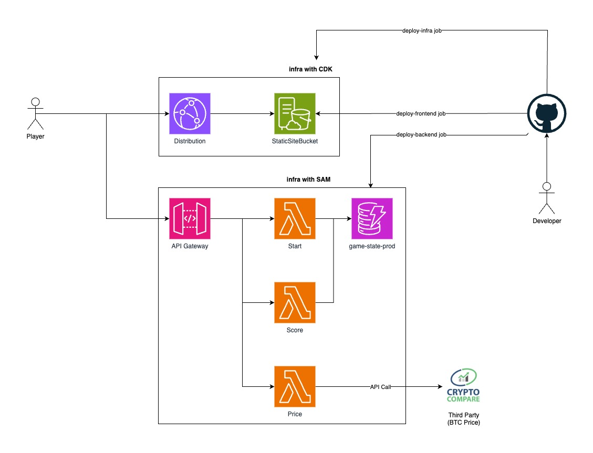

# Bitcoin game

## Application Architecture

### Frontend

- The website is served as a Single Page Application hosted in AWS S3 and served through cloudfront.
- The infra for this is maintained with `AWS CDK`. At the moment I do not have any domain for the
  project, but the hosted zone and certificate could be added easily to the stack.
- We have to beware that Cloudfront is a global cache for assets. If we want to see the last
  deployed changes immediately in the browser, we will have to create a new invalidation in
  Cloudfront (using `/*` as path).

### Backend

- The backend part is developed and deployed using `AWS SAM`.
- I ended up creating three lambdas:
  - **start**: This lambda is responsible for starting a new game. If first time user, it will
    create a new session and store it in dynamodb, then send a cookie to the client with the
    `sessionId` in it. This `sessionId` will be used in future accesses to the game so that the user
    can carry on with the score they had.
  - **score**: The job of this lambda is to get the guess information once it is resolved (the price
    at the time of the guess, the final price at the end, and what was the user's guess), calculate
    the new score, update it in the database then return it to the user. I also introduced the
    concept of variance, which indicates to the frontend by how much are we incrementing or
    decrementing the score on each guess resolution, so that the frontend can let the user know what
    was the different. This is also useful just in case we wanted to add any new business rules in
    the future around scores.
  - **price**: backend for frontend in charge of fetching the btc price from a third party API
    (cryptocompare).

**⚠️ Disclaimer:** This is not an ideal solution, because there is a lot of logic in the frontend
and the game rules could be bypassed easily with very little technical knowledge. The ideal solution
should go through implementing websockets in the backend to get real time updates from the server
and send messages to the backend from the frontend.

## Decisions on Game Logic and Limitations

Based on the requirements I ended up making some decision in order to improve the user experience:

- The user does not see at the moment the game instructions, however that's something we could show
  with little effort. We'd only need to change the `GameLoader` component to not to call the
  `/start` endpoint right away but only on user action when clicked a button, for example.
- The user gets the latest Bitcoin price every 5 seconds. This is enough time for the third party
  API to get the newest value.
- When the user clicks on a guess (Up or Down), we show them what was their choice and what was the
  Bitcoin price at the time of their selection. Otherwise in 60 seconds would be easy to forget what
  was the price when they clicked the button and if the secore is correct.
- When we calculate the score, we also show them the final price when the guess was resolved, so
  that the score calulation is clear for the user. Sadly, since the guesses are not persisted in the
  DynamoDB database, we cannot show them the history.

## How I Would Have Done It For A Production Game

- I would have done the Frontend sillier and avoid having any game logic. Just rely on the backend
  for that.
- The backend would have been accessible through websockets. This would have allowed two way
  communication: the frontend to send user guesses and the backend to send the current Bitcoin price
  and Guess results.
- All the guesses for a user would have been stored in DynamoDB. DynamoDB would have had probably
  three different Secondary Keys: Session, Score and Guess. This way we could store all information
  in the same table.

## More Information About the Apps

- [Backend](./apps/backend/README.md)
- [Frontend](./apps/frontend/README.md)
- [Infra](./apps/infra/README.md)
